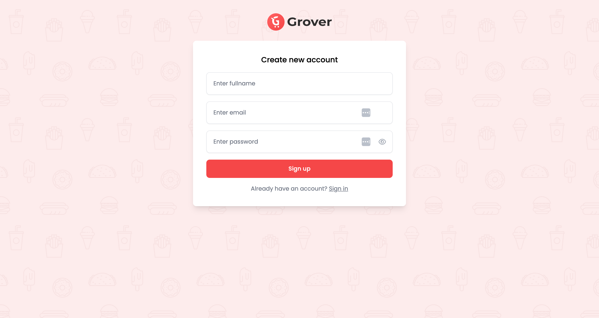
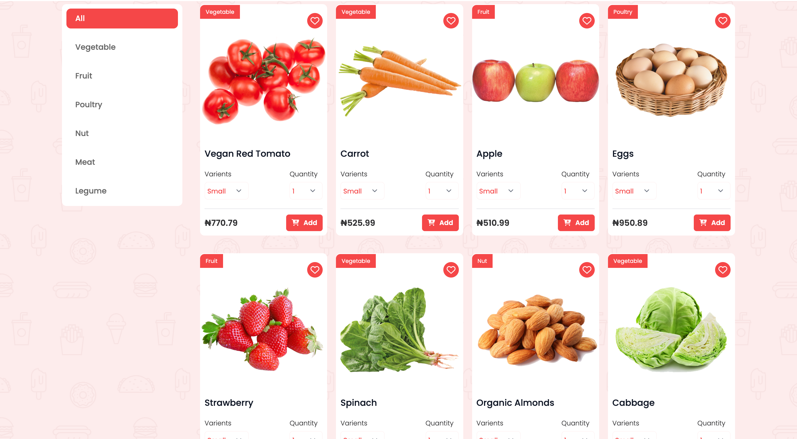
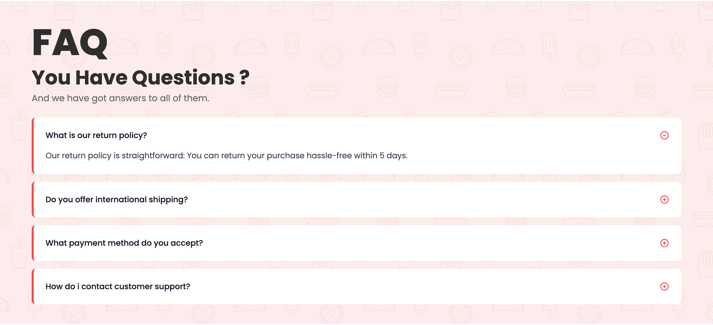
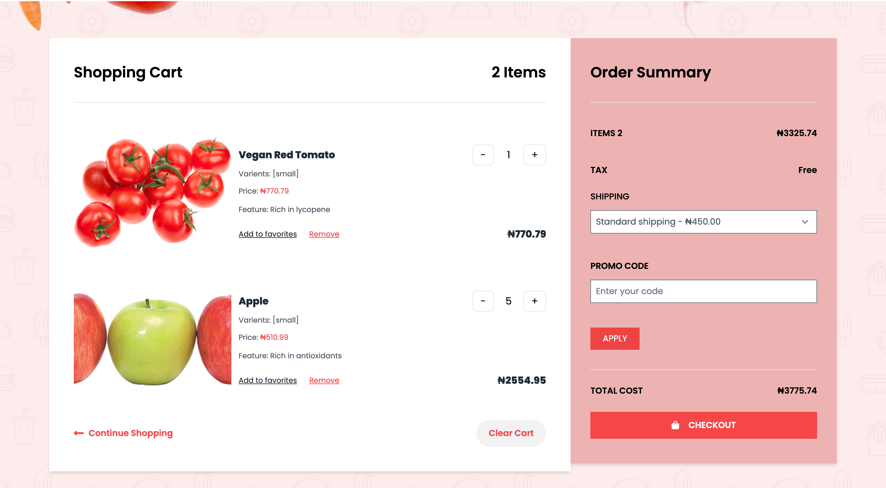
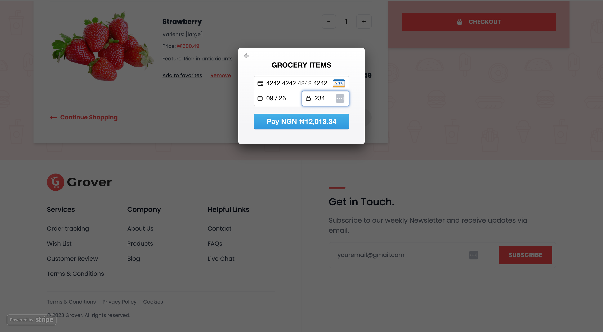
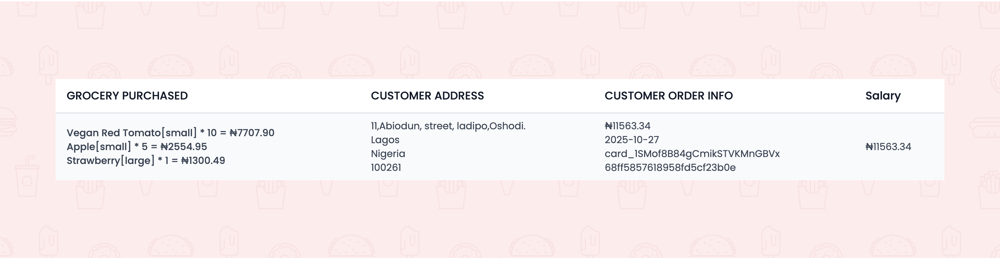

# 🛒 Groceries — Natural Products For Organic Lovers

A modern and user-friendly eCommerce platform that connects people with clean, fresh, and healthy organic produce.  
Built for customers who love nature and care deeply about what they eat.

---

## 🚀 Overview

**Groceries** is a full-stack web application that allows users to browse farm-fresh organic food, add items to their cart, and securely complete purchases using **Stripe**.  
It includes real authentication, order tracking, a sleek UI, and a mission to promote healthy living.

The app delivers high performance with a seamless and delightful shopping experience across all devices.

---

## ✨ Key Features

- 🔐 **User Authentication**  
  Signup and login using secure token-based auth.

- 🛍️ **Add to Cart**  
  Users select farm products and manage cart items.

- 💳 **Stripe Secure Payments**  
  Checkout with confidence using encrypted, real-time Stripe transactions.

- 📦 **Order History**  
  Successfully purchased items are stored and displayed for the user.

- ❓ **FAQ Page**  
  Quick answers and support directly inside the app.

- 📱 **Fully Responsive**  
  Tailwind layouts adjusting beautifully to mobile, tablet, and desktop screens.

---

## 🖼 Screenshots

### 🔹 Home

### 🔹 Signin/Signout

### 🔹 All products

### 🔹 Frequently Ask Question

### 🔹 Cart

### 🔹 Stripe Payment

### 🔹 Orders

---

## 🛠 Built With

- **React** – Interactive user interface  
- **Redux** – State management for dynamic shopping experience  
- **Tailwind CSS** – Utility-first responsive styling  
- **Node.js + Express.js** – Backend API and server logic  
- **MongoDB** – Scalable NoSQL product & order storage  
- **Stripe Payment API** – Enables secure online payments  

---

## 🌟 Live Demo

👉 [View Portfolio](https://farmfood.netlify.app)

---

## 📂 Project Structure

📦 Groceries
┣ 📁 Client (React + Redux + Tailwind)
┣ 📁 backend (Node, Express, MongoDB, Stripe)
┣ 📄 README.md

---

